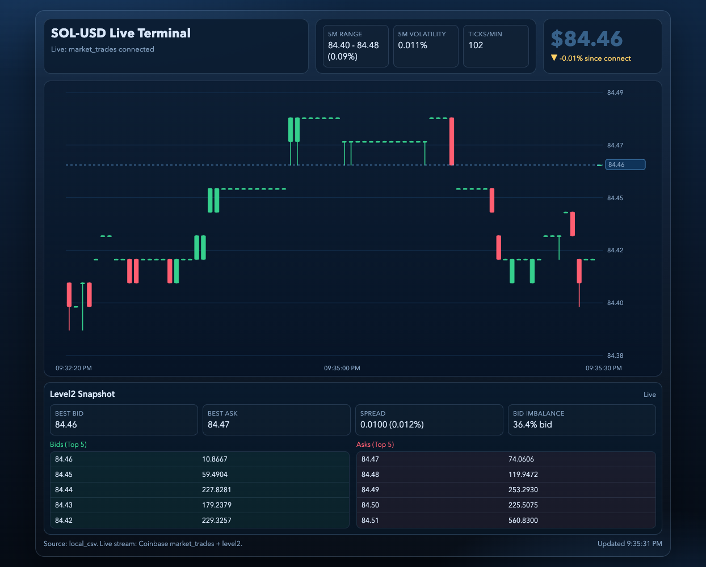

# Crypto Live Update

Standalone multi-market live terminal app (Coinbase):
- top toggle: `SOL-USD`, `BTC-USD`, `SOL-BTC`
- live candlestick updates from Coinbase `market_trades`
- top-of-book + spread/imbalance from Coinbase `level2`
- REST bootstrap for recent candles + order book hydration
  
Live in https://sol-live-ticker-update.onrender.com/
## Preview



## Setup

```bash
cd sol_live_update
python3 -m venv .venv
. .venv/bin/activate
python -m pip install -r requirements.txt
```

## Run (single command)

```bash
cd sol_live_update
. .venv/bin/activate
python scripts/run_live_terminal.py \
  --host 127.0.0.1 \
  --port 8765
```

Open:
- http://127.0.0.1:8765/live_crypto_dashboard.html

## Startup Scripts

- Local entrypoint: `scripts/run_live_terminal.py`
  - starts `scripts/serve_live_dashboard.py`

## Data Flow

- `/api/bootstrap`: Coinbase REST candles (`/products/{product}/candles`)
- `/api/orderbook`: Coinbase REST order book (`/products/{product}/book`)
- Browser websocket: `wss://advanced-trade-ws.coinbase.com`
  - subscribes to `market_trades` and `level2` for all supported pairs

## Folder layout

- `scripts/` runner and local API server
- `web/` modular dashboard (`html/css/js`)
